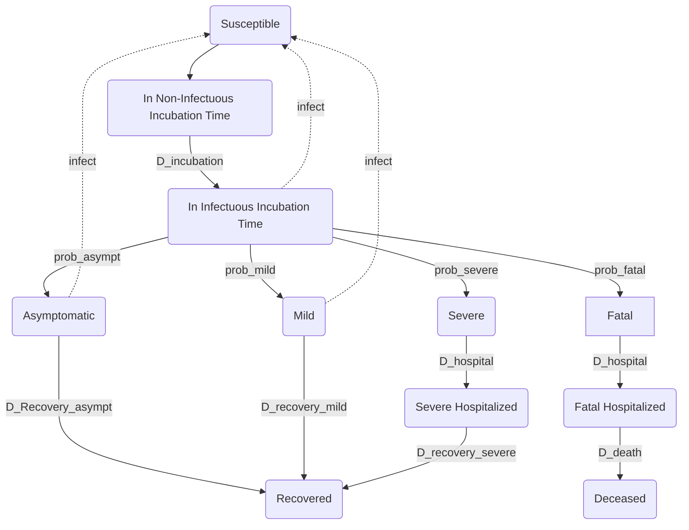

# REPO for Corona-related Modelling

### Motivation
This model is meant to illustrate the dynamic impact of various policy paths. Most existing COVID simulators only allow for a single policy parameter. This is important when thinking about exist strategies for the time after the initial peak in infections.

### Disclaimer
This model is not meant to be used as a forecasting tool. It is very hard to make accurate forecasts for the current epidemic. FiveThirtyEight has a [post](https://fivethirtyeight.com/features/why-its-so-freaking-hard-to-make-a-good-covid-19-model/?utm_campaign=Data_Elixir&utm_source=Data_Elixir_279) on why that is. Instead, we aim to illustrate the key mechanics of a standard SEIR model when changing policy dynamically. 

We have tried very hard to stick to standard modelling assumptions and check our work against existing implementations. However, this model was not built by expert epidemiologists and should not be treated as such. 

Picking the right parameters is very difficult since many important parameters are currently unknown (e.g. the share of asymptomatic infections). Moreover, model results are very sensitive to parameter choices. We kept most parameters variable so you can see the effect of changing assumptions on the outcome.

### Interactive Demo
You can play with the [interactive version](https://quirky-mclean-bf617d.netlify.com) of the model in your browser [underlying code](https://github.com/alsino/corona-impact-analysis).

### Related work
* [COVID Calculator](http://gabgoh.github.io/COVID/) ([Code](https://github.com/gabgoh/epcalc/blob/master/src/App.svelte))
* [Jim Stock on liftoff and the importance of the asymptomatic rate](https://drive.google.com/file/d/12MV466ZZy5xHir4xdPhoTrL1oO8CbZU-/view)
* [COVID Scenarios by Neherlab](https://neherlab.org/covid19/)

### Modelling Approach
We have followed the [code](https://github.com/gabgoh/epcalc/blob/master/src/App.svelte) that is underlying the Covid Calculator closesly. We extended the model in a couple of ways. Most importantly, we allow for dynamic policy paths. Moreover, we have added a few additional features. For example, we allow for asymptomatic infections, which turns the share of asymptomatic infections into an important parameter. Please check `seir.py` for the exact model mechanics.

#### Flow diagram

#### Dynamic Equations

#### Authors
Friedrich Geiecke  
Alsino Skowronnek  
Wolfgang Ridinger  
Maximilian Eber  
