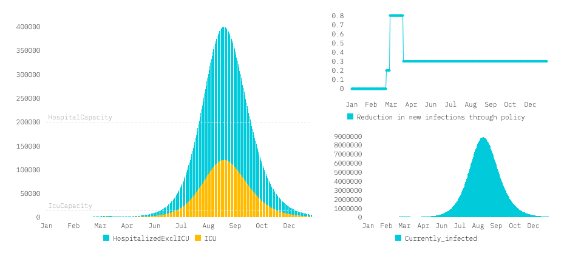

# COVID-19 Policy Simulations

### Motivation
This model is meant to illustrate the dynamic impact of various policy paths. Most existing COVID simulators only allow for a single policy intervention. The set of interventions, however, is important when thinking about exist strategies for the time after the initial peak of infections. __For an in detail summary of the model, both verbally and mathematically, please see the notebook [model summary.](https://github.com/maximilianeber/covid/blob/development/summary.ipynb)__

### Disclaimer
This model is not meant to be used as a forecasting tool. It is very hard to make accurate forecasts for the current epidemic. FiveThirtyEight has a [post](https://fivethirtyeight.com/features/why-its-so-freaking-hard-to-make-a-good-covid-19-model/?utm_campaign=Data_Elixir&utm_source=Data_Elixir_279) on why that is. Instead, we aim to illustrate the key mechanics of a simple SEIR model when changing policy dynamically. 

We have tried to stick to standard modelling assumptions and check our work against existing implementations. Yet, this model is a simple illustrative tool and not even close to a sophisticated state of the art model in current epidemiology, it should hence not be treated as such. 

Another important issue which the dashboard and model hopefully illustrate is that even simple models have many degrees of freedom. Picking the right parameter values is very difficult as many important parameters are currently unknown and subject of ongoing research (e.g. the share of asymptomatic infections, duration of the infectious part of the incubation time). Importantly, model results are very sensitive to parameter choices. We kept most parameters adjustable in the dashboard so you can see the effect of changing assumptions on the outcome.

### Interactive dashboard
You can play with the [interactive version](https://covid19-scenarios.netlify.com) of the model in your browser [underlying code](https://github.com/alsino/corona-impact-analysis).

### Related work
* [COVID Calculator](http://gabgoh.github.io/COVID/) ([Code](https://github.com/gabgoh/epcalc/blob/master/src/App.svelte))
* [Jim Stock on liftoff and the importance of the asymptomatic rate](https://drive.google.com/file/d/12MV466ZZy5xHir4xdPhoTrL1oO8CbZU-/view)
* [COVID Scenarios by Neherlab](https://neherlab.org/covid19/)

### Modelling Approach
We have followed the [code](https://github.com/gabgoh/epcalc/blob/master/src/App.svelte) that is underlying the Covid Calculator closesly. We extended the model in a couple of ways. Most importantly, we allow for dynamic policy paths which affect infections caused by all individuals or only by symptomatic individuals. For this, we have added a few additional features. For example, compartments for the asymptomatic part of the incubation period (shared by all individuals) or the share of individuals with an asymptomatic course throughout. Please check the [model summary](https://github.com/maximilianeber/covid/blob/development/summary.ipynb) and `seir.py` for the exact model mechanics.

#### Authors
Friedrich Geiecke  
Alsino Skowronnek  
Wolfgang Ridinger  
Maximilian Eber  
