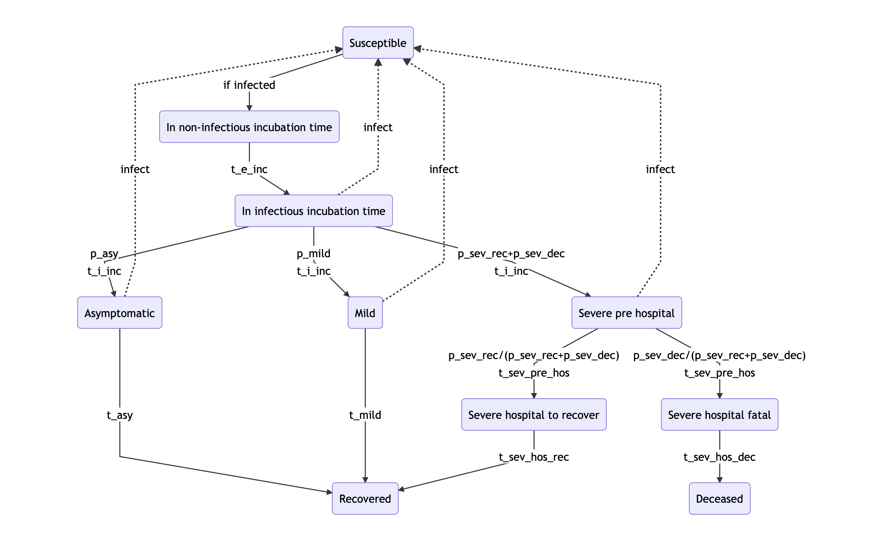

# REPO for Corona-related Modelling

## Excecutive Summary
* We use standard epidemiological model to evaluate different policy paths
    * Different policies correspond to different values for `R0`
    * Given assumptions, we can simulate infection rates and compare case numbers to hospital capacity
* Outcomes are extremely sensitive to assumptions, which are crucial for evaluating policy responses
    * We do not (yet) know how many asymptomatic cases there are
    * We do not (yet) know the effect of policy measures on `R`
    * We do not (yet) know much about clinical dynamics
* What we can do to reduce this uncertainty
    * Create a representative panel of the population to observe asymptomatic infections. This becomes more important as the epidemic progresses.
    * Track and measure effectiveness of current policies
    * Track and measure clinical dynamics

## Modelling Approach

## Related material
* [COVID Calculator](http://gabgoh.github.io/COVID/) ([Code](https://github.com/gabgoh/epcalc/blob/master/src/App.svelte))
* [Jim Stock on liftoff and the importance of the asymptomatic rate](https://drive.google.com/file/d/12MV466ZZy5xHir4xdPhoTrL1oO8CbZU-/view)
* [Very basic SEIR equations](https://www.datahubbs.com/social-distancing-to-slow-the-coronavirus/)
