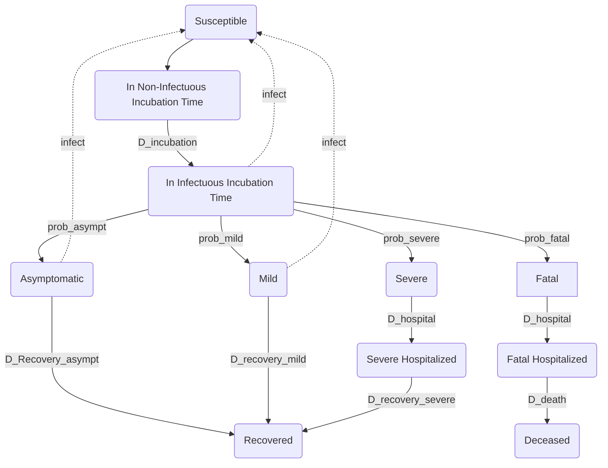

```mermaid

graph TD;
  S(Susceptible)
    --> E;
  E(In Non-Infectuous Incubation Time)
    -->|D_incubation|I;
  I(In Infectuous Incubation Time)
    -->|prob_asympt| Asympt;
  I -->|prob_mild| Mild;
  I -->|prob_severe| Severe;
  I -->|prob_fatal| Fatal;
  Asympt(Asymptomatic)
    -->|D_Recovery_asympt| R(Recovered);
  Mild(Mild)
    -->|D_recovery_mild|R;
  Severe(Severe)
    -->|D_hospital|S_H;
  S_H(Severe Hospitalized)
    -->|D_recovery_severe|R;
  Fatal
    -->|D_hospital|F_H;
  F_H(Fatal Hospitalized)
    -->|D_death| Deceased(Deceased);
  Asympt -.->|infect| S;
  Mild   -.->|infect| S;
  I      -.->|infect| S;
```
