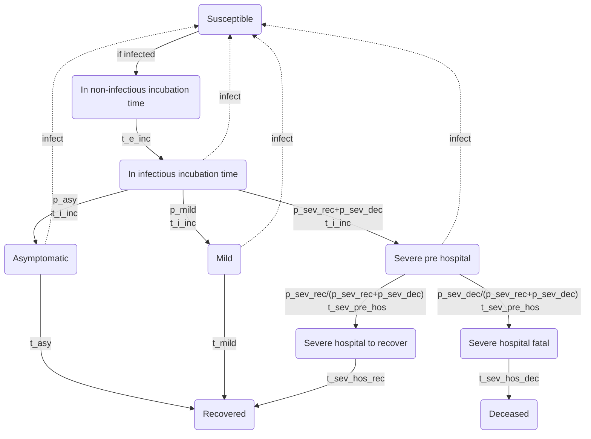

```mermaid

graph TD;
  S(Susceptible)
    -->|if infected|E;
  E(In non-infectious incubation time)
    -->|t_e_inc|I;
  I(In infectious incubation time)
    -->|p_asy <br> t_i_inc| Asympt;
  I -->|p_mild <br> t_i_inc| Mild;
  I -->|p_sev_rec+p_sev_dec  <br> t_i_inc|Severe(Severe pre hospital);
  Severe -->|"p_sev_rec/(p_sev_rec+p_sev_dec) <br> t_sev_pre_hos"|S_H_R(Severe hospital to recover);
  Severe -->|"p_sev_dec/(p_sev_rec+p_sev_dec) <br> t_sev_pre_hos"|S_H_D(Severe hospital fatal);
  Asympt(Asymptomatic)
    -->|t_asy| R(Recovered);
  Mild(Mild)
    -->|t_mild|R;
  S_H_R -->|t_sev_hos_rec| R;
  S_H_D -->|t_sev_hos_dec|D(Deceased);
  Asympt -.->|infect| S;
  Mild   -.->|infect| S;
  I      -.->|infect| S;
  Severe -.->|infect| S;
```
